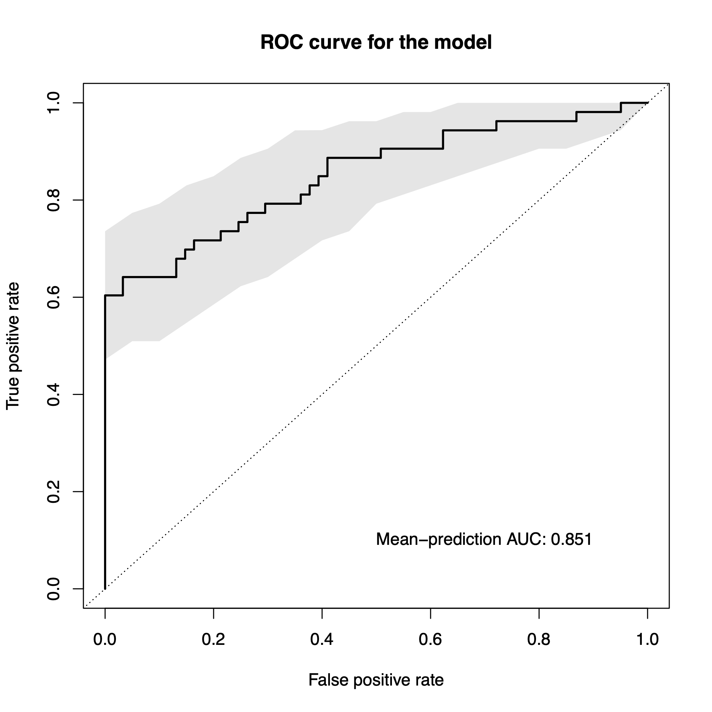
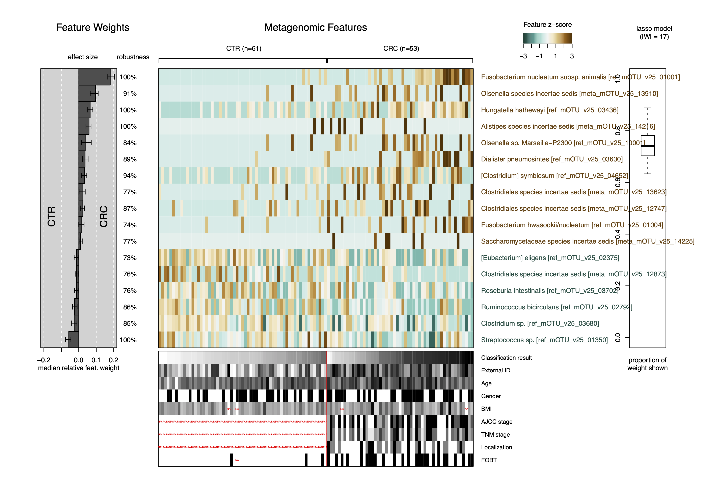

In this practical, we are going to explore statistical testing methods for 
metagenomic data, how to visualize the results, and how to train machine 
learning models using the `SIAMCAT` package.

```{r setup, include=FALSE}
knitr::opts_chunk$set(collapse=TRUE)
```

# Setup

## Preparing the R environment 

In order to get started, we should first prepare our `R` environment and load
the packages we will need later on. Additionally, the data used in this 
practical are stored on the EMBL servers and we can set the base path for the
downloads.

```{R prep, message=FALSE}
library("tidyverse") # for general data wrangling and plotting
library("SIAMCAT")   # for statistical and ML analyses

data.location <- 'https://embl.de/download/zeller/metaG_course/'
```

## Loading the Data

In this practical, we are going to have a look at the data from
[Zeller et al. _MSB_ 2014](https://doi.org/10.15252/msb.20145645). In this 
study, the authors recruited patients with **colorectal cancer (CRC)** 
and **healthy controls (CTR)** and performed shotgun metagenomic sequencing 
of fecal samples. The raw data have already been pre-processed and analyzed 
with the [mOTUs2](https://doi.org/10.1038/s41467-019-08844-4) taxonomic 
profiler.

### Features

First, we are going to load the taxonomic profiles and store them as a matrix.

```{R load_data, message=FALSE, warning=FALSE}
fn.feat.fr  <- paste0(data.location, '/motus_profiles/FR-CRC.motus')
tax.profiles <- read.table(fn.feat.fr, sep = '\t', quote = '', 
                           comment.char = '', skip = 61, 
                           stringsAsFactors = FALSE, check.names = FALSE, 
                           row.names = 1, header = TRUE)
tax.profiles <- as.matrix(tax.profiles)
```

The taxonomic profiles contain absolute counts and can easily be transformed
into relative abundances using the `prop.table` function:

```{R rel_ab}
rel.tax.profiles <- prop.table(tax.profiles, 2)
```

### Metadata

Additionally, we also need the information which sample belongs to which group.
Therefore, we are loading the metadata table as well:

```{R load_metadata, message=FALSE}
fn.meta.fr  <- paste0(data.location, '/metadata/meta_FR-CRC.tsv')
df.meta <- read_tsv(fn.meta.fr)
df.meta
table(df.meta$Group)
```

We are interested in the comparison between control samples (`CTR`) and 
colorectal cancer samples (`CRC`), so we first remove the other samples, 
which represent advanced adenoma (`ADA`) or non-advanced adenoma (`NAA`).
Also, we transform the metadata into a data.frame object (which is easier 
for some analyses later on).

```{r clean_metadata}
df.meta <- df.meta %>% 
  filter(Group %in% c('CRC', 'CTR')) %>% 
  as.data.frame()
rownames(df.meta) <- df.meta$Sample_ID

# restrict the taxonomic profiles to CRC and CTR samples
tax.profiles <- tax.profiles[,rownames(df.meta)]
rel.tax.profiles <- rel.tax.profiles[,rownames(df.meta)]
```

## Feature filtering

Currently, the matrix of taxonomic profiles contains `14213` different 
bacterial species. Of those, not all will be relevant for our question, since
some are present only in a handful of samples (low prevalence) or at extremely
low abundance. Therefore, it can make sense to filter your taxonomic profiles
before you begin the analysis. Here, we could for example use the maximum
species abundance as a filtering criterion. All species that have a relative
abundance of at least `1e-03` in at least one of the samples will be kept, 
the rest is filtered out. 


```{r filter_features}
species.max.value <- apply(rel.tax.profiles, 1, max)
f.idx <- which(species.max.value > 1e-03)
rel.tax.profiles.filt <- rel.tax.profiles[f.idx,]
```

Additionally, the mOTUs2 profiler can also estimate how much of the relative 
abundance cannot be classified. We also filter out this share of "Unknown".

```{r filter_features_2}
# unclassified are indicated by -1 in the mOTUs2 profiles
idx.um <- which(rownames(rel.tax.profiles.filt) == '-1')
rel.tax.profiles.filt <- rel.tax.profiles.filt[-idx.um,]
```


# Association Testing

Now that we have set up everyting, we can test all microbial species 
for statistically significant differences. In order to do so, we perform a 
Wilcoxon test on each individual bacterial species.

```{r assoc_testing}
p.vals <- rep_len(1, nrow(rel.tax.profiles.filt))
names(p.vals) <- rownames(rel.tax.profiles.filt)
stopifnot(all(rownames(df.meta) == colnames(rel.tax.profiles.filt)))
for (i in rownames(rel.tax.profiles.filt)){
  x <- rel.tax.profiles.filt[i,]
  y <- df.meta$Group
  t <- wilcox.test(x~y)
  p.vals[i] <- t$p.value
}
head(sort(p.vals))
```

The species with the most significant effect seems to be _Fusobacterium
nucleatum_, so let us take a look at the distribution of this species:

```{r, fuso}
species <- 'Fusobacterium nucleatum subsp. animalis [ref_mOTU_v25_01001]'
df.plot <- tibble(fuso=rel.tax.profiles.filt[species,],
                  label=df.meta$Group)
df.plot %>% 
  ggplot(aes(x=label, y=fuso)) + 
    geom_boxplot() + 
    xlab('') + 
    ylab('F. nucleatum rel. ab.')
```

Let us remember that log-scales are important when visualizing relative 
abundance data!

```{r fuso_2}
df.plot %>% 
  ggplot(aes(x=label, y=log10(fuso + 1e-05))) + 
    geom_boxplot(outlier.shape = NA) +
    geom_jitter(width = 0.08) + 
    xlab('') + 
    ylab('log10(F. nucleatum rel. ab.)')
```

# SIAMCAT Association Testing

We can also use the `SIAMCAT` R package to test for differential abundance and
produce standard visualizations.

```{r siamcat, message=FALSE}
library("SIAMCAT")
```

Within `SIAMCAT`, the data are stored in the `SIAMCAT` object which contains 
the feature matrix, the metadata, and information about the groups you want to
compare.

```{r sc.obj}
sc.obj <- siamcat(feat=rel.tax.profiles, meta=df.meta, 
                  label='Group', case='CRC')
```

We can use `SIAMCAT` for feature filtering as well:

```{r sc_filtering}
sc.obj <- filter.features(sc.obj, filter.method = 'abundance', cutoff = 1e-03)
sc.obj <- filter.features(sc.obj, filter.method = 'prevalence', 
                          cutoff = 0.05, feature.type = 'filtered')
sc.obj
```

Now, we can test the filtered feature for differential abundance with `SIAMCAT`:

```{r sc_assoc_testing, eval=FALSE}
sc.obj <- check.associations(sc.obj, detect.lim = 1e-05, 
                             fn.plot = './associations.pdf')
```
```{r sc_assoc_testing_real, message=FALSE, echo=FALSE}
sc.obj <- check.associations(sc.obj, detect.lim = 1e-05, 
                             panels = c('fc'),
                             prompt = FALSE)
```

# Exercises: Visualization 


* The associations metrics computed by `SIAMCAT` are stored in the `SIAMCAT` 
object and can be extracted by using `associations(sc.obj)`, if you want to 
have a closer look at the results for yourself. Plot a volcano plot of the 
associations between cancer and controls using the output from `SIAMCAT`.

* **Optional** Create a ordination plot for our data and colour the samples 
by group. How would you interpret the results? Try out different ecological 
distances. How does the choice of distance affect the group separation?
(**Tip**: make sure to check out the `vegdist` function in the **vegan** 
package and also the `pco` function in the **labdsv** package)

# Machine learning with SIAMCAT

## Machine learning workflow

The `SIAMCAT` machine learning workflow consists of several steps:

```{r diagrammr, echo=FALSE}
library(DiagrammeR)

grViz("
digraph siamcat_workflow {

  # a 'graph' statement
  graph [overlap = true, fontsize = 10]

  # several 'node' statements
  node [shape = box,
  fontname = Helvetica,
  label='filter.features']
  C

  node [shape = box,
  fontname = Helvetica,
  label='normalize.features']
  F

  node [shape = box,
  fontname = Helvetica,
  label='create.data.split']
  G

  node [shape = box,
  fontname = Helvetica,
  label='train.model']
  H

  node [shape = box,
  fontname = Helvetica,
  label='make.predictions']
  I

  node [shape = box,
  fontname = Helvetica,
  label='evaluate.prediction']
  J

  node [shape = box,
  fontname = Helvetica,
  label='model.evaluation.plot']
  K

  node [shape = box,
  fontname = Helvetica,
  label='model.interpretation.plot']
  L

  # several 'edge' statements
  C->F
  F->G G->H H->I I->J J->K
  J->L
  }
")

```

Since we already created a `SIAMCAT` object and filtered the raw data, we can
start directly with the next step.

## Normalization

`SIAMCAT` offers a few normalization approaches that can be useful for
subsequent statistical modeling in the sense that they transform features in
a way that can increase the accuracy of the resulting models. Importantly,
these normalization techniques do not make use of any label information
(patient status), and can thus be applied up front to the whole data set 
(and outside of the following cross validation).

```{r normalization}
sc.obj <- normalize.features(sc.obj, norm.method = 'log.std',
                             norm.param = list(log.n0=1e-05, sd.min.q=0))
sc.obj
```

## Cross validation split

Cross validation is a technique to assess how well an ML model would generalize 
to external data by partionining the dataset into training and test sets.
Here, we split the dataset into 10 parts and then train a model on 9 of these
parts and use the left-out part to test the model. The whole process is 
repeated 10 times.

```{r cv}
sc.obj <- create.data.split(sc.obj, num.folds = 10, num.resample = 10)
```


## Model Training

Now, we can train a
[LASSO logistic regression classifier](https://www.jstor.org/stable/2346178)
in order to distinguish CRC cases and controls.

```{r training}
sc.obj <- train.model(sc.obj, method='lasso')
```

## Predictions

This function will automatically apply the models trained in cross validation 
to their respective test sets and aggregate the predictions across the whole 
data set.

```{r predictions}
sc.obj <- make.predictions(sc.obj)
```

## Model Evaluation 

Calling the `evaluate.predictions` funtion will result in an assessment of
precision and recall as well as in ROC analysis, both of which can be plotted
as a pdf file using the `model.evaluation.plot` funtion (the name of/path to
the pdf file is passed as an argument).

```{r evaluate_predictions}
sc.obj <- evaluate.predictions(sc.obj)
model.evaluation.plot(sc.obj, fn.plot = './eval_plot.pdf')
```



## Model interpretation

Finally, the `model.interpretation.plot` function will plot characteristics 
of the models (i.e. model coefficients or feature importance) alongside the 
input data aiding in understanding how / why the model works (or not).

```{r interpreation_plot}
model.interpretation.plot(sc.obj, consens.thres = 0.7,
                          fn.plot = './interpretation_plot.pdf')
```




# Exercise: Prediction on external data

On the EMBL cluster, there is another dataset from a colorectal cancer 
metagenomic study. The study population was recruited in Austria, so you can
find the data under:
```{R at_set}
fn.feat.at <- paste0(data.location, '/motus_profiles/AT-CRC.motus')
fn.meta.at <- paste0(data.location, '/metadata/meta_AT-CRC.tsv')
```

* Apply the trained model on this dataset and check the model performance 
on the external dataset.

* Train a `SIAMCAT` model on the Austrian dataset and apply it to the French 
dataset. How does the model transfer on the external dataset compare between
the two datasets? Compare also the feature weights when training on the French
or Austrian dataset.  
**Note**: You can supply several SIAMCAT objects to the function 
`model.evaluation.plot` and compare two ROC curves in the same plot.

# Exercise: Taxonomic vs functional predictors

In addition to the taxonomic profiles, we also created functional profiles
for the French dataset. You can find it under:
```{R kegg data}
fn.feat.fr.kegg <- paste0(data.location, 
                          '/functional_profiles/KEGG_kos_FR-CRC.tsv')
```

* Explore the distribution of the functional data (abundance distribution, 
prevalence, etc.) and compare it to what you observe with the taxonomic 
profiles. Which filtering regime would make sense for functional data?

* Use `SIAMCAT` to train a model based on the functional KEGG profiles and 
compare it to the one trained on taxonomic profiles.  
**Note** Since the functional profiles will have many thousands features,
it makes sense to perform feature selection on your dataset. You can 
supply the parameters for the feature selection to the `train.model` function
in `SIAMCAT`.

# Further information

You can find more information about `SIAMCAT` on https://siamcat.embl.de 
or on Bioconductor under 
https://www.bioconductor.org/packages/release/bioc/html/SIAMCAT.html

There you can also find several vignettes which go into more detail about 
different applications for `SIAMCAT`.

# SessionInfo

```{R}
sessionInfo()
```